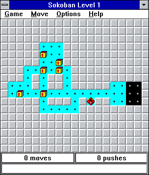

# Sokoban

An Elm implementation of the Sokoban game for Windows 3.x, made in order to learn Redux and leveraging the HTML5 Canvas library.

Trying to make the look and feel as close to the game game I played as a child:

**Note:** This was originally created in JavaScript in order to get to know the Redux framework. The old repository can be found here: [https://github.com/lieberkind/sokoban/tree/legacy-js](https://github.com/lieberkind/sokoban/tree/legacy-js)

## Try it out
To play, go to [http://elm-sokoban.lieberkind.io](http://elm-sokoban.lieberkind.io).

## Credits
This game is a direct port of Allan B. Liss' Sokoban for Windows release 2.2.5 from 1992. I don't take credit for invention of levels, gameplay or any design.

All sprites have been recreated with the help of the great online sprite editor [Piskel](https://www.piskelapp.com/)

## Thanks to
Thanks to Jens Peter Lieberkind for helping me discover bugs and weird behaviours, and for proposing feature enhancements.
